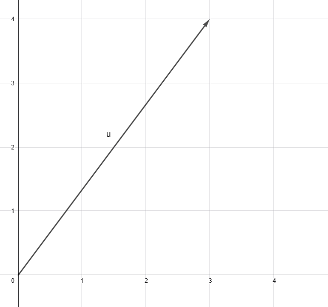
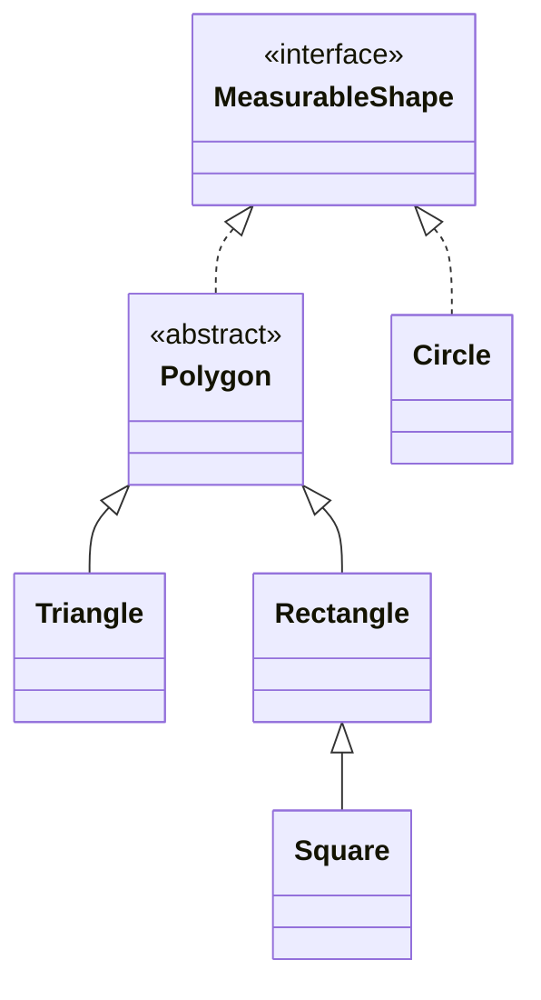

# Shapes! _The Lab_

You've probably used calculators like Desmos or Geogebra in math class--or perhaps even more complex tools for 3D
modeling, like TinkerCAD or Fusion360 (or something else). All of these programs rely heavily on object-oriented
design patterns. In this lab you will demonstrate your understanding of these same OOP principles to build the
"brains" of a simple geometry calculator.

## Structure

This project has two main parts--the main geometry classes and the underlying vector class. These work together
to perform the necessary calculations.

### Vector Class

The `PlaneVector` class contains several functions for operating on 2D vectors. Hopefully you'll remember these from math class.
In case you don't, here is a simple definition:

> [!NOTE]
> A **vector** is a mathematical object with both _magnitude_ and _direction_.

Although, in practice, we often use vector to mean any ordered tuple. Since we're in 2D for this project, we will be working with 2D vectors represented as ordered pairs. For example, the vector in the image below represents the vector $\textbf{u} = <3, 4>$

    

We call the elements of this pair the x- and y- _components_

In the `PlaneVector` class, the components are represented by an _immutable_ `Pair<Double, Double>`

#### Functions

The `PlaneVector` class contains the following functions which you should implement:

Assume vectors $\textbf{u} = <u_x, u_y>$ and $\textbf{v} = <v_x, v_y>$:

| Function | Meaning | Computation |
| --- | --- | --- |
| `u.x()` | x-component of $\textbf{u}$ | $u_x$ |
| `u.y()` | y-component of $\textbf{u}$ | $u_y$ |
| `u.plus(v)` | $\textbf{u} + \textbf{v}$ | $<u_x + v_x,\ u_y + v_y>$ |
| `u.minus(v)` | $\textbf{u} - \textbf{v}$ | $<u_x - v_x,\ u_y - v_y>$ |
| `u.dot(v)` | $\textbf{u} \cdot \textbf{v}$ | $u_x v_x + u_y v_y$ |
| `u.scl(scl)` | $scl \cdot \textbf{u}$ | $<scl \cdot u_x,\ scl \cdot u_y>$ |
| `u.normSquared()` | $\lVert \textbf{u} \rVert ^2$ | $u_x^2 + u_y^2$ |
| `u.norm()` | $\lVert \textbf{u} \rVert$ | $\sqrt{u_x^2 + u_y^2}$ |
| `u.unitVector()` | $\hat{\textbf{u}}$ | $<\dfrac{u_x}{\lVert \textbf{u} \rVert},\ \dfrac{u_y}{\lVert \textbf{u} \rVert}>$ |
| `u.theta()` | $\theta$ | $\operatorname{atan2}(u_y,\ u_x)$ |
| `u.xComponentVector()` | x-component of $\textbf{u}$ | $<u_x,\ 0>$ |
| `u.yComponentVector()` | y-component of $\textbf{u}$ | $<0,\ u_y>$ |
| `u.cross(v)` | $ \textbf{u} \times \textbf{v} $ | $ u_x v_y - u_y v_x $ |

Note that the `PlaneVector` class is also immutable, so each of these will return a _new_ vector--they do not modify the existing vector.

### Shape Classes

